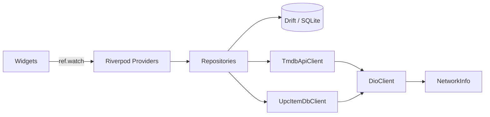
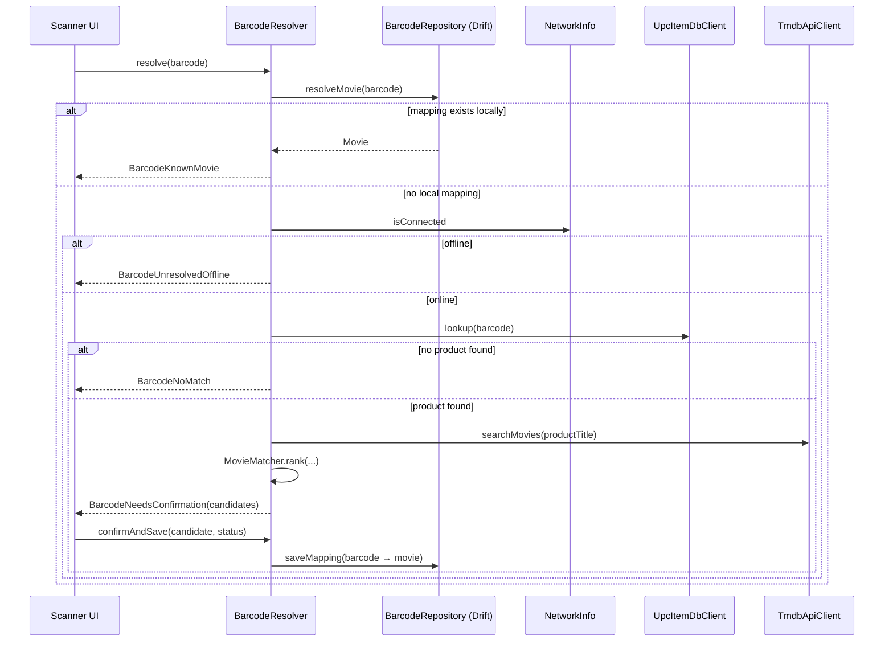
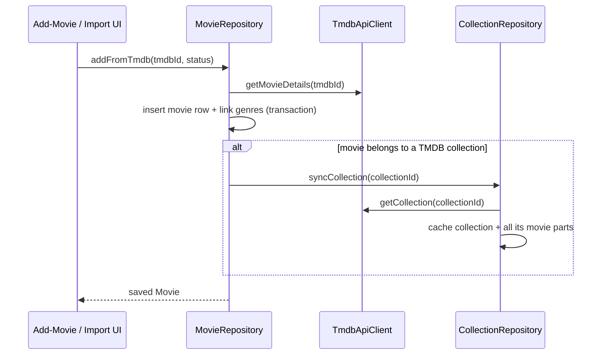

# Architecture

## Guiding principle

**SQLite is the source of truth for the user's collection.** TMDB and UPCitemdb are only
used to *enrich* data (metadata, collection info) and to *resolve* unknown barcodes/titles.
A failed API call must never delete, corrupt, or hide anything the user already saved
locally.

## Folder structure

```
lib/
  app/                    MaterialApp, go_router setup, bottom-nav shell, theme
  core/
    config/               Env (dart-define secrets)
    constants/             API + app constants
    database/             Drift tables, AppDatabase, converters, row→domain mappers
    errors/                Sealed AppException hierarchy
    matching/              MovieMatcher, MediaTitleParser, ItemSelection
    network/               DioClient, TMDB client, UPCitemdb client
    providers/             Riverpod providers wiring db/network/repositories
    utils/                 TitleNormalizer, date parsing, season labels
  features/
    collection/            "Sammlung" screen: Filme | Serien, filters, sort, search
    collections/            "Reihen" (TMDB collections) + missing movies
    editions/               PhysicalEditionRepository (box-set contents)
    home/                   Dashboard
    import/                 Text/CSV import: parse → typed ImportTarget → review → commit
    movie_details/          Single movie details screen
    movies/                 MovieRepository + movie stream providers
    scanner/                Barcode resolution + "Fundstück-Check" flow
    search/                 TMDB title search + add-movie flow
    settings/               Settings/about + view-mode persistence
    tv/                     TvRepository + series details
  shared/
    models/                 Movie, TvSeries, TvSeason, PhysicalEdition, CollectionStatus, ImportTarget
    widgets/                Reusable UI: PosterImage, StatusChip, SelectableItemList, ...
```

Each feature keeps `data/` (repositories talking to Drift/network), `domain/` (pure models
and orchestration logic with no Flutter/DB imports), and `presentation/` (widgets) separate
where the feature is non-trivial. Simple features (e.g. `home`) skip layers that would add
no value — the brief explicitly asks not to overengineer this into interfaces for their own
sake.

## Layering / data flow



- Widgets never touch Drift or Dio directly. They call `ref.watch`/`ref.read` on providers.
- Repositories are the only classes that know about both the database and the network. They
  decide what gets cached, what's stale, and how failures degrade gracefully.
- `DioClient` centralizes timeout/error-mapping so every API client gets consistent
  `AppException`s (`NoInternetException`, `RateLimitException`, `InvalidApiConfigException`,
  etc.) instead of raw `DioException`s leaking into the UI.

## Riverpod usage

The project uses **manual Riverpod providers** (no `riverpod_generator`/code-gen) to avoid
version conflicts with `drift_dev`/`freezed` in the code-generation pipeline. Patterns used:

- `Provider` — singletons/factories with no async lifecycle (`AppDatabase`, `TmdbApiClient`,
  repositories).
- `StreamProvider` / `StreamProvider.family` — live queries from Drift (`watchAllMovies()`,
  `watchCollection(id)`), so the UI updates automatically the instant something is
  saved/changed, with zero manual cache invalidation.
- `StateNotifierProvider` — screen-level workflows with imperative steps (`FundstueckController`,
  `ImportController`, `CollectionFilterController`).
- Plain `Provider` for derived/computed state (`filteredMoviesProvider`, `collectionCountsProvider`)
  that combines other providers instead of duplicating state.

All async DB/network operations are wrapped in `AsyncValue` (`.when(loading:, error:, data:)`
in the UI), so every screen has consistent loading/error/data states without ad-hoc
`FutureBuilder` boilerplate.

## Repository boundaries

| Repository | Owns | Talks to |
|---|---|---|
| `MovieRepository` | Personal collection rows, genre links | Drift, `TmdbApiClient`, `CollectionRepository` |
| `TvRepository` | TV series + season ownership | Drift, `TmdbApiClient` |
| `PhysicalEditionRepository` | Physical box sets and their movie/season contents | Drift |
| `CollectionRepository` | Cached TMDB collections + their movie lists | Drift, `TmdbApiClient` |
| `BarcodeRepository` | Barcode → movie or physical-edition mappings | Drift only (no network — see below) |
| `BarcodeResolver` | Orchestrates barcode → movie/TV/box resolution | `BarcodeRepository`, `PhysicalEditionRepository`, `BarcodeProvider`, `TmdbApiClient`, `NetworkInfo`, `MediaTitleParser` |
| `ImportRepository` | Bulk text/CSV import matching + commit | `TmdbApiClient`, `MovieRepository`, `TvRepository`, `PhysicalEditionRepository` |

`BarcodeRepository` is intentionally network-free: it only knows about the local
barcode↔movie table. Resolving an *unknown* barcode is a distinct concern
(`BarcodeResolver`), which composes the repository with the network. This keeps "is this
barcode known locally?" trivially testable and fast, and keeps the barcode-provider
abstraction (`BarcodeProvider`) swappable without touching persistence code.

## Offline-first strategy

- **Known movies/barcodes**: served entirely from Drift `Stream` queries — no network call in
  the read path at all.
- **Known collections**: `CollectionRepository.syncCollection` caches TMDB collection data
  with a `lastSyncedAt` timestamp and skips re-fetching for
  `AppConstants.collectionStaleAfter` (7 days) unless `forceRefresh: true`. Cached collections
  render fully offline.
- **Unknown barcode while offline**: `BarcodeResolver` checks `NetworkInfo.isConnected` *before*
  attempting any network call and returns `BarcodeUnresolvedOffline` — the UI explains a
  connection is needed and still offers manual title entry.
- **Metadata staleness**: `MovieRepository.isMetadataStale` compares `lastMetadataSyncAt`
  against `AppConstants.metadataStaleAfter` (14 days); the movie details screen uses this to
  offer an explicit "refresh metadata" action rather than refetching on every open.
- **Posters**: `cached_network_image` persists images to disk; `PosterImage` shows a
  placeholder/error icon instead of breaking layout when an image is unavailable or offline.
- **Failures never corrupt local state**: e.g. in `MovieRepository.addFromTmdb`, if collection
  sync fails after the movie itself was already saved, the exception is swallowed (movie
  stays saved) — collection completeness is a cache, not a dependency for the save to
  succeed.

## Barcode resolution flow



Once `saveMapping` runs, the same barcode resolves through the top ("mapping exists locally")
branch forever after — no repeated API calls for a barcode you've already resolved.

## TMDB metadata / collection flow



If `syncCollection` throws (offline, rate-limited, etc.), `MovieRepository` catches and
ignores it — the movie is still saved, just without series-completeness data until the next
successful sync.

Import persistence is separate: `ImportRepository.commit` fetches full movie details, then
upserts inside a **per-source-row** transaction (see [docs/IMPORT.md](IMPORT.md)). Genre and
collection rows are reused across movies via `tmdb_id` upserts. `addFromTmdb` remains the
API for the single-title add screen and still throws `DuplicateMovieException` when that
title is already stored.

## Navigation

`go_router` with `StatefulShellRoute.indexedStack` drives five persistent bottom-nav tabs
(Home, Sammlung, Reihen, Fundstück/Scanner, Mehr), each keeping its own navigation state when
switching tabs. Screens reached from *within* a tab (movie details, search, add-movie, import,
settings, collection detail, missing movies, Fundstück result) are pushed on the root
navigator via `parentNavigatorKey`, so they appear as full-screen pages above the bottom nav
rather than nested inside a tab.
