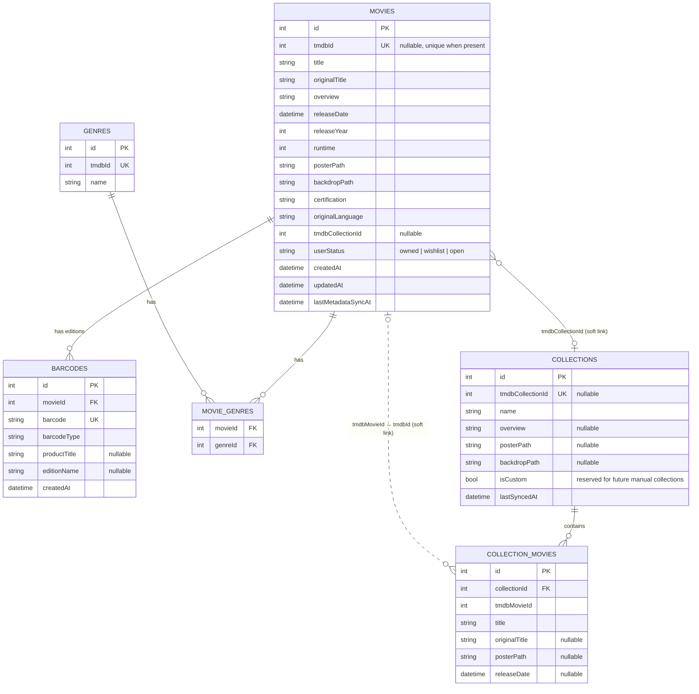

# Database

Movie Shelf uses [Drift](https://drift.simonbinder.eu/) over SQLite. The database class is
`AppDatabase` (`lib/core/database/app_database.dart`), currently at **schema version 2**. The
database file is named `movie_shelf.sqlite` and lives in the platform's application
documents directory (`getApplicationDocumentsDirectory()`), so it survives app restarts and
updates but is removed if the user uninstalls the app or clears app data.

Schema 2 adds TV series/seasons, physical editions (box sets), and a nullable `barcodes.movie_id`
plus `barcodes.physical_edition_id`. Existing movie data is preserved: the v1→v2 migration
creates one `singleMovie` physical edition per existing barcode mapping.

## Entity-relationship diagram

## Tables

### `movies` — the user's personal collection (source of truth)

One row per movie the user has explicitly saved (owned, wishlisted, or marked open). This is
**not** a cache of all known TMDB movies — only movies the user chose to add.

| Column | Notes |
|---|---|
| `id` | Local autoincrement primary key. Used everywhere else in the app (routes, foreign keys). |
| `tmdbId` | Nullable but **unique when present** — enforces "no duplicate TMDB movie" at the DB level in addition to the repository-level check. |
| `title`, `originalTitle`, `overview`, `releaseDate`, `releaseYear`, `runtime`, `posterPath`, `backdropPath`, `certification`, `originalLanguage` | TMDB-sourced metadata, cached locally so the app works offline. |
| `tmdbCollectionId` | Nullable. If set, the movie belongs to a TMDB collection; join against `collections.tmdbCollectionId` to find the cached collection. |
| `userStatus` | `CollectionStatus` enum (`owned`/`wishlist`/`open`), persisted via `CollectionStatusConverter` as the **stable English enum name**, never the German display label — see [Collection statuses](#collection-statuses-column-encoding). |
| `createdAt` / `updatedAt` | Set on insert / bumped on any update (status change, metadata refresh). |
| `lastMetadataSyncAt` | Drives the "is this stale?" check (`MovieRepository.isMetadataStale`, 14-day default). |

Indexes: `idx_movies_tmdb_collection` on `tmdb_collection_id`, `idx_movies_status` on
`user_status` (fast filtering by status/collection in the Sammlung screen).

### `barcodes` — physical edition → movie mapping

A **separate table**, deliberately not a column on `movies`, because one movie can have many
physical releases (German DVD, Blu-ray, Steelbook, re-release, ...), and one barcode can
represent a whole box set.

| Column | Notes |
|---|---|
| `movieId` | Nullable FK → `movies.id`, `ON DELETE CASCADE`. Set for single-movie discs; null when the barcode maps only to a physical edition. |
| `physicalEditionId` | Nullable FK → `physical_editions.id`. The scanned product (single disc or box). |
| `barcode` | **Unique** — one barcode maps to exactly one physical product at a time. |
| `barcodeType` | e.g. `EAN-13`, `EAN-8`, `UPC-A`. |
| `productTitle` | Raw product title from the barcode provider. |
| `editionName` | Optional free-text edition label (e.g. "Blu-ray", "Steelbook"). |

Do not copy a box-set barcode onto every contained movie. Store the edition once and link its
contents through `physical_edition_movies` / `physical_edition_tv_seasons`.

Index: `idx_barcodes_movie` on `movie_id`, `idx_barcodes_edition` on `physical_edition_id`.

**Remapping**: `BarcodeRepository.saveMapping` throws `DuplicateBarcodeException` if a
barcode is already assigned to a *different* movie, unless `allowRemap: true` is passed
(used when the user explicitly confirms a different match during Fundstück-Check).

### `genres` / `movie_genres` — many-to-many

`genres` caches TMDB genre id/name pairs (deduplicated by `tmdbId`, which is unique).
Inserts must upsert on **`tmdb_id`**, not on the local autoincrement `id`. Drift's
`insertOnConflictUpdate` uses `ON CONFLICT("id")`, which does **not** handle a shared genre
and raises `UNIQUE constraint failed: genres.tmdb_id`. `AppDatabase.upsertGenre` uses
`ON CONFLICT(tmdb_id) DO UPDATE`. `movie_genres` is a plain join table with a composite
primary key `(movieId, genreId)`; both columns cascade-delete with their parent row.

The same upsert-on-`tmdb_id` rule applies to `collections.tmdb_collection_id`.

### `collections` — cached TMDB collections (+ future manual collections)

| Column | Notes |
|---|---|
| `tmdbCollectionId` | Nullable + unique. Null is reserved for **future** manual/custom collections (not implemented in v1, but the schema already supports it via `isCustom`). |
| `isCustom` | Boolean, defaults to `false`. Not used by any current feature — future-proofing only, as requested by the project brief. |
| `lastSyncedAt` | Drives the 7-day staleness window in `CollectionRepository.syncCollection`. |

### `collection_movies` — every movie known to belong to a collection

This represents **all** TMDB movies in a series, including ones the user does not own. It is
intentionally decoupled from `movies` by `tmdbMovieId` (an int, not a foreign key to
`movies.id`) because most entries won't have a corresponding locally-owned movie. At read
time, `CollectionRepository._buildCollectionWithEntries` looks up
`movies` where `tmdbId == collection_movies.tmdbMovieId` to decide whether each entry is
owned/wishlisted/open/missing.

Unique key: `(collectionId, tmdbMovieId)` — prevents duplicate parts if a collection is
re-synced. Index: `idx_collection_movies_collection` on `collection_id`.

### `tv_series` / `tv_seasons` / `tv_series_genres`

TV series are **not** stored as fake movies. `tv_series` holds TMDB series metadata.
`tv_seasons` holds each season; `user_status` is nullable (`owned` / `wishlist` / `open`).
A null status means **Fehlt** and is not persisted as a user-selected value.

Season 0 (Specials) is stored when TMDB provides it, but "complete series" / "all seasons"
logic uses `seasonNumber > 0` unless the user explicitly includes Specials.

Index: `idx_tv_seasons_series` on `series_id`. Unique: `(series_id, season_number)`.

### `physical_editions` / `physical_edition_movies` / `physical_edition_tv_seasons`

A physical product (single disc or box) with `mediaKind`:

`singleMovie` | `movieBundle` | `singleTvSeason` | `tvSeasonBundle` | `completeTvSeries`

Contents are linked by local movie ids and season ids. Barcodes point at the edition, not at
every contained title.

## Collection statuses (column encoding)

`CollectionStatus` is a plain Dart enum (`owned`, `wishlist`, `open`) with a `germanLabel`
extension (`Gekauft`, `Wunschliste`, `Offen`) used only for display.
`CollectionStatusConverter` (a Drift `TypeConverter`) persists the **English enum name**
(`status.name`) as the database value — never the translated label — so the German UI text
can change freely without a migration, and so parsing is unambiguous
(`CollectionStatus.fromName` falls back to `open` for any unrecognized/legacy value instead
of throwing).

## Migration strategy

`AppDatabase.schemaVersion` is `2`.

- **onCreate** creates all current tables and indexes.
- **onUpgrade from < 2** creates the TV and physical-edition tables, makes `barcodes.movie_id`
  nullable, adds `barcodes.physical_edition_id`, and backfills one `singleMovie` edition per
  existing barcode so previous installs keep working.

Never wipe the database to ship a schema change. When the schema changes again:

1. Bump `schemaVersion`.
2. Add another `from < N` step in `onUpgrade`.
3. Never edit a table definition in place without an accompanying migration step.

## Deletion semantics

Deleting a movie (`MovieRepository.deleteMovie`) only removes the `movies` row (and, via
cascade, its `barcodes` and `movie_genres` rows). It **never** touches `collections` or
`collection_movies` — cached series data is independent of which of its parts you currently
own, so deleting a personal movie cannot corrupt series-completeness data for the rest of the
collection.
